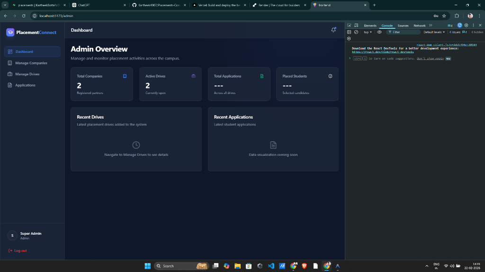
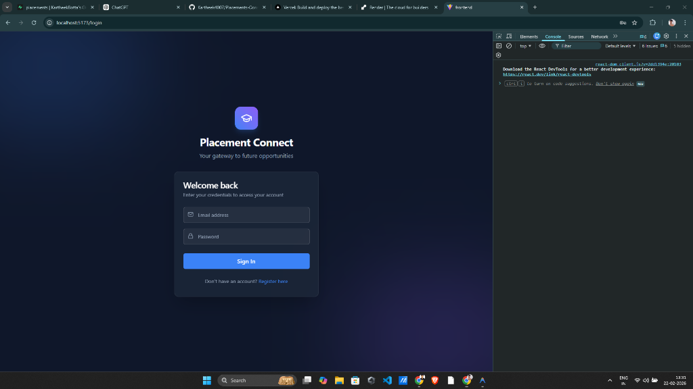

# Placement Connect 🎓

**Placement Connect** is a high-performance, high-density placement management system designed to streamline the recruitment process for both students and administrators. Built with a "Modern Nocturnal" aesthetic, it offers an immersive, professional experience with robust tracking and management capabilities.




## 🚀 Key Features

### For Administrators
- **Corporate Onboarding**: Manage company profiles and partnership details.
- **Drive Registry**: Create and manage placement drives with specific eligibility criteria (CGPA, CTC, Location).
- **Application Portal**: Real-time tracking and status management (Applied, Selected, Rejected) of student applications.
- **Results Broadcasting**: Broadcast placement results with file attachments or external links.
- **System Insights**: Global statistics on total companies, active drives, and placement rates.

### For Students
- **Opportunity Hub**: 3-column high-density listing of active placement drives.
- **Identity Forge**: Centralized profile and resume management.
- **Progress Tracking**: Clear visibility into application statuses.
- **Outcomes View**: Quick access to official placement results.

## 🛠️ Tech Stack

### Frontend
- **Framework**: React 19 (Vite)
- **Styling**: Tailwind CSS v4 (Modern Nocturnal Theme)
- **Components**: Radix UI, Lucide React
- **Animations**: Framer Motion
- **Networking**: Axios

### Backend
- **Framework**: FastAPI (Python)
- **ORM**: SQLAlchemy
- **Database**: PostgreSQL (Supabase)
- **Authentication**: JWT (Jose, Passlib, Bcrypt)
- **Migrations**: Alembic

---

## ⚙️ Setup & Installation

### Prerequisites
- Python 3.9+
- Node.js 18+
- PostgreSQL database (or Supabase account)

### Backend Setup
1. Navigate to the `backend` directory:
   ```bash
   cd backend
   ```
2. Create a virtual environment and install dependencies:
   ```bash
   python -m venv venv
   source venv/bin/activate  # On Windows: venv\Scripts\activate
   pip install -r requirements.txt
   ```
3. Configure environment variables in `.env`:
   ```env
   DATABASE_URL=your_postgresql_url
   SECRET_KEY=your_secret_key
   SUPABASE_URL=your_supabase_url
   SUPABASE_KEY=your_supabase_key
   ```
4. Run migrations and start the server:
   ```bash
   alembic upgrade head
   python -m uvicorn app.main:app --reload
   ```

### Frontend Setup
1. Navigate to the `frontend` directory:
   ```bash
   cd frontend
   ```
2. Install dependencies:
   ```bash
   npm install
   ```
3. Start the development server:
   ```bash
   npm run dev
   ```

---

## 🎨 Design Philosophy: "Modern Nocturnal"
The UI focuses on **Information Density** and **Professional Aesthetics**.
- **Compact UI**: Optimized spacing and typography to maximize data visibility without clutter.
- **Glassmorphism**: Subtle translucent surfaces and glowing micro-accents for a premium feel.
- **High Contrast**: Dark background with vibrant secondary and primary accents (Indigo/Sky Blue).

---

## 📄 License
Distributed under the MIT License. See `LICENSE` for more information.

---
*Built with ❤️ for better placements.*
